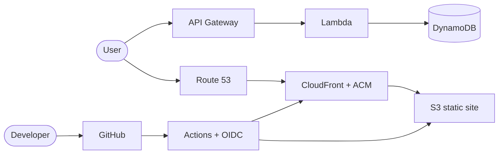

# Saiful Khan

### Solution Architect · Senior DevOps / SRE · Cloud Architect

 

---

## About Me

I design and deliver **production cloud platforms** — identity & access, edge delivery, CI/CD, and serverless data paths — with a focus on security, operability, and cost.

My portfolio site **[khansaiful.com](https://khansaiful.com)** is a live AWS Cloud Resume Challenge build (not a static brochure): hosting, HTTPS, DNS, serverless APIs, and automated deploys.

- 🔭 Cloud architecture, platform engineering, and reliable delivery pipelines
- 🌐 Live portfolio: **[khansaiful.com](https://khansaiful.com)**
- 🛠️ AWS · Azure · Kubernetes · Terraform · GitHub Actions · Python
- 📌 Open to **Solutions Architect**, **Senior DevOps/SRE**, and cloud engineering roles

---

## Live architecture — [khansaiful.com](https://khansaiful.com)

| Layer | What it does |
|---|---|
| **Edge** | Route 53 → CloudFront + ACM → S3 (OAC, HTTPS) |
| **Serverless** | API Gateway → Lambda → DynamoDB (visitor count + contact) |
| **Delivery** | GitHub Actions + OIDC → S3 sync + CloudFront invalidation |
| **Next** | Terraform IaC migration **in progress** |

---

## Experience & strengths

<table>
<tr>
<td width="50%" valign="top">

### 🧭 What I build

- Secure AWS / Azure architectures for scalable systems  
- CI/CD and automation across environments  
- Kubernetes, Docker, and cloud-native platform design  
- Platform engineering with operational excellence  

</td>
<td width="50%" valign="top">

### 💪 How I work

- Architecture trade-offs: security, cost, reliability  
- Least-privilege IAM, OIDC federation, edge hardening  
- Serverless APIs and event-driven patterns  
- Clear docs so systems stay operable after go-live  

</td>
</tr>
</table>

---

## Featured projects

<table>
<tr>
<td width="50%" valign="top">

### ☁️ AWS Cloud Resume Challenge
**[khansaiful.com](https://khansaiful.com)**

Production portfolio: Vite → S3/CloudFront, Route 53, Lambda visitor counter, contact API, GitHub Actions OIDC.

[Open live site →](https://khansaiful.com)

</td>
<td width="50%" valign="top">

### 🌐 Multi-Region AWS Deployment

Resilient traffic distribution and failover patterns across regions.

[View project →](https://nextwork.ai/radiant_cyan_daring_clementine/docs/596362ad-0e33-40be-95a1-8f2b201dd44e)

</td>
</tr>
<tr>
<td width="50%" valign="top">

### ⚙️ Amazon EKS Backend

Containerized workloads on Kubernetes with secure AWS integration.

[View project →](https://github.com/Saifulrubkhan/aws-cloud-projects/blob/main/05-containers-compute/29-k8s-backend/aws-compute-eks4.md)

</td>
<td width="50%" valign="top">

### 🤖 AI Agent Application

Full-stack AI app (Spring AI + Angular) for documents and automation workflows.

[View project →](https://github.com/Saifulrubkhan/ai-agent-spring-boot-angular.git)

</td>
</tr>
</table>

---

## Tech stack

  

  
  
  
  

---

## Certifications

  
  
  
  

  📄 More on my resume → <a href="https://khansaiful.com/resume.html"><b>khansaiful.com/resume.html</b></a>

---

## GitHub snapshot

  
  

   
  

---

## Let’s connect

Looking for a Solutions Architect or Senior DevOps/SRE who can design cloud systems, automate delivery, and keep platforms production-ready? Let’s talk.

 

**Build once. Operate safely. Improve continuously.**

